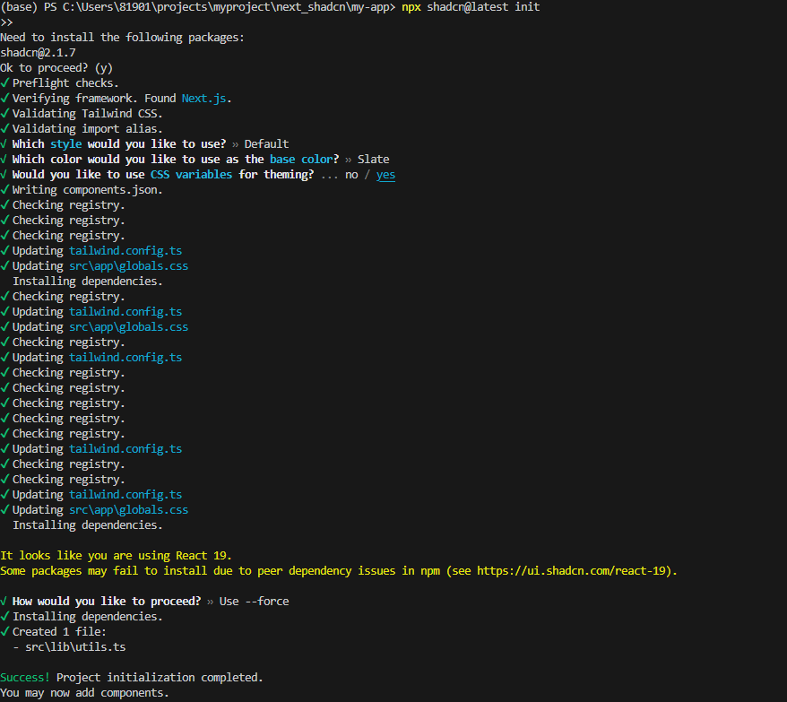
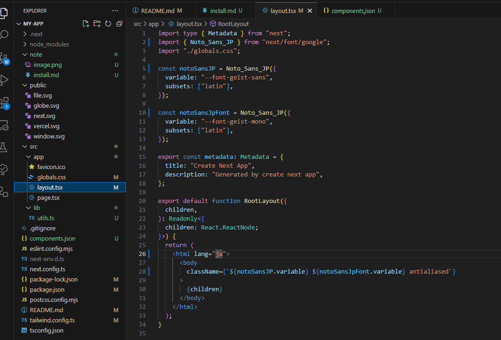

## Nextjs15

```
npx create-next-app@latest my-app --typescript --tailwind --eslint
```

## shadcn

https://ui.shadcn.com/docs/installation/next

```
npx shadcn@latest init
```

- 選択画面
  

## 設定

- Noto_Sans_JP に変更
  
